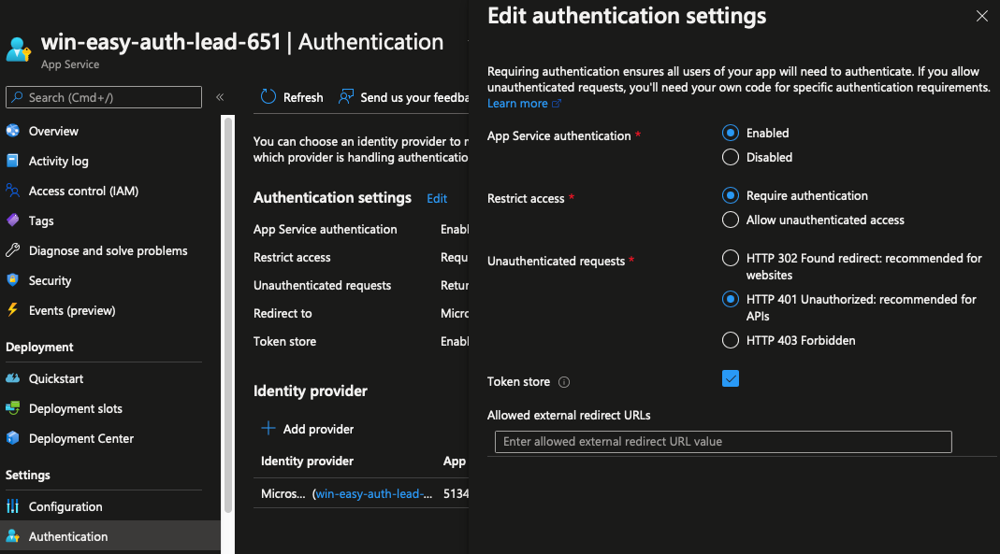

# README

A basic web app that that demonstrates environment variables differences depending
on Easy Auth configuration.

# Setup

You can either create an Azure Pipeline project and configure it to use the included template or
copy/paste the templates inline scripts into a Powershell command prompt. (If you take the
later option, you will have to update the `az webapp deployment source config-zip` command - 
change the path of the `--src` argument to a path on your machine.)

Once deployed, navigate to the Authentication blade and add the Microsoft Identity Provider.
Accept the default options when prompted.

# Issue

Browse to https://win-easy-auth-lead-651.azurewebsites.net/debug/auth-me and take note
of the result.

If everything works correctly, you should get something like this:

```json
{ "name":"<your-identity>", "email":null, "iss":"https://login.microsoftonline.com/<your-tenant-id>/v2.0", "ver":"2.0" }
```

Then navigate back to the Authentication blade and edit the Authentication settings - change 
Unauthenticated requests from "HTTP 302 Found redirect" (the default) to "HTTP 401 Unauthorized":



Allow the web app a minute to restart before browsing to https://win-easy-auth-lead-651.azurewebsites.net/debug/auth-me.

This time you should see the following:

```json
{ "name":"not authenticated", "email":null, "iss":null, "ver":null }
```

# What is causing the problem

If you browse https://win-easy-auth-lead-651.azurewebsites.net/debug/environment, before and after the
Authentication settings change, you'll notice several differences. The difference causing the issue is that
WEBSITE_AUTH_DEFAULT_PROVIDER is missing.

`Microsoft.Identity.Web.AppServicesAuthenticationHandler.HandleAuthenticateAsync()` will only set 
`ControllerBase.User` if this environment variable is present.
